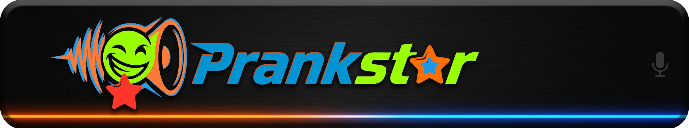
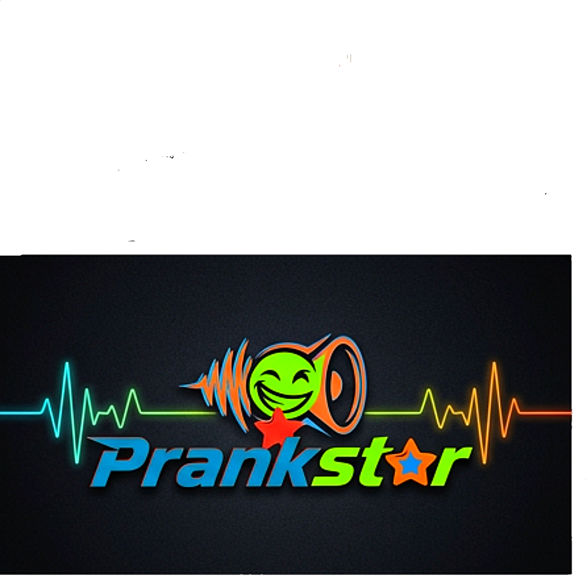

<div align="center">
  
</div>

<div align="center">

# Prankster Lab v2

<p>
  <strong>Premium prank soundboard • Audio lab • Reactive sound experience</strong>
</p>

<p>
  
  
  
  
</p>

</div>

---

## Overview

**Prankster Lab v2** is a premium prank soundboard and audio utility built for fast, fun, and highly organized sound triggering. The project blends a polished user interface with a growing audio catalog, advanced sound-management workflows, and a strong foundation for reactive, prank-oriented interactions.

<div align="center">
  
</div>

It is designed to feel less like a basic button board and more like a **stylized audio playground**: a place where users can browse categories, trigger sounds instantly, explore curated packs, and eventually build sequences, randomizers, and generated audio experiences.

---

## At a glance

| Category | Details |
|---|---|
| **Project name** | Prankster Lab v2 |
| **Primary platform** | Android |
| **Core stack** | Kotlin, Jetpack Compose, Android MediaPlayer, DataStore, Gradle Kotlin DSL |
| **Supporting stack** | React, Vite, TypeScript, Tailwind CSS, Express, Node.js tooling |
| **Focus** | Premium prank soundboard, audio library, validation, and creative sound workflows |
| **Current state** | Actively evolving / not yet production release-ready |

---

## Core experience

Prankster Lab v2 is built around a few major pillars:

### 1) Instant sound triggering
- Fast access to prank audio
- Tap-to-play behavior
- Quick button-friendly design
- Clear preview labels
- Reliable stop / playback handling architecture

### 2) Organized audio browsing
- Categorized sound discovery
- Theme-based audio packs
- Metadata-driven sound listings
- Intensity and safety tags for smarter sorting
- Asset paths structured for maintainability

### 3) Premium UI direction
- Dark cyberpunk-inspired look and feel
- Neon-style presentation
- Layered surfaces and animated composition
- HUD-like interaction language
- Designed to feel polished rather than generic

### 4) Expandable audio system
- Room for randomizer workflows
- Sequence building
- Generated sound management
- Voice synthesis / procedural audio
- Sound forge style editing features
- Offline playback support

<div align="center">
  
</div>

---

## Major features and capabilities

### Soundboard features
- Category-based sound library navigation
- One-tap triggering of prank sounds
- Playback previews before committing to a sound
- Loopable and non-loopable sound support
- Metadata such as intensity, tags, and recommended use
- Visual cues for quick sound recognition

### Library features
- Large catalog of prank audio assets
- Multiple themed categories
- Voice lines, animal sounds, cartoon effects, glitches, sci-fi tones, and more
- Clean asset organization by folder and category
- Catalog-based management for maintainability

### Creative playback features
- Sound sequencing roadmap
- Randomized playback roadmap
- Scheduling roadmap
- Timed reactions and stop handling
- Future waveform-driven preview and editing support

### Tooling and safety features
- Sound validation scripts
- Catalog integrity checks
- Release inspection notes
- Safe sourcing guidance for royalty-free audio
- Build readiness documentation

---

## Featured audio categories

The repository’s sound data and planning docs show a broad, curated prank library organized around themed packs such as:

- **Funny** — silly reactions, goofy effects, comedic audio
- **Creepy Lite** — subtle suspense without overdoing it
- **Office** — mouse clicks, chair squeaks, printer jams, typing
- **Robot** — servo hums, monotone voices, system tones
- **Cartoon** — boings, bonks, splats, slip sounds
- **Animal** — cats, dogs, birds, monkeys, frogs, and more
- **Glitch** — digital static, stutters, error bursts
- **Sci-Fi** — laser zaps, airlock hiss, warp sounds
- **Voice** — fighter/game-style voice lines and callouts
- **Misc** — assorted prank-friendly extras

This structure makes the app easy to browse while keeping the content playful and varied.

---

## Current architecture and stack

### Android stack
- **Kotlin** for the native app layer
- **Jetpack Compose** for modern UI
- **Android MediaPlayer** for real playback
- **DataStore** for persistent preferences
- **Gradle Kotlin DSL** for build configuration

### Web/tooling stack
- **React** for catalog/tooling UI and shared frontend work
- **Vite** for fast local development and builds
- **TypeScript** for typed tooling logic
- **Tailwind CSS** for rapid styling
- **Express** and Node.js scripts for local tooling and validation
- Supporting utilities for sound generation and validation

---

## Repository structure

Typical top-level areas include:

- `app/` — Android application source
- `src/` — shared data / tooling / web source
- `public/` — public web assets
- `docs/` — inspections, plans, and roadmap notes
- `tools/` — validation scripts and asset tooling
- root media assets such as `prankster_header.png`, `prankster_logo.png`, and `prankster_boot.mp4`

---

## Scripts

From `package.json`:

| Script | Purpose |
|---|---|
| `npm run dev` | Start the Vite dev server |
| `npm run build` | Build the web/tooling app |
| `npm run preview` | Preview a production build |
| `npm run clean` | Remove build output |
| `npm run lint` | Run TypeScript checks |
| `npm run validate:sounds` | Validate sound assets |

---

## Getting started

### Web / tooling setup
```bash
npm install
npm run dev
```

### Android validation build
```bash
./gradlew clean assembleDebug --stacktrace
```

If you’re working on audio or release preparation, the docs also reference catalog and asset validation commands that should be run before shipping.

---

## Audio sourcing philosophy

Prankster Lab v2 takes audio quality and safety seriously.

### Recommended sourcing principles
- use royalty-free or fully owned audio
- prefer CC0 / properly licensed sources
- avoid copyrighted TV, movie, or meme audio rips
- avoid emergency tones or panic-inducing sounds
- normalize and trim audio for consistent playback
- keep filenames predictable and clean

This makes the project easier to maintain and safer to distribute.

---

## Release status

The repo documentation indicates the project is **not yet release-ready for production store submission**.

### Current focus areas
- manual device QA
- dependency audit remediation
- build and toolchain cleanup
- audio library integrity improvements
- completion of randomizer and sequence builder features
- further refinement of advanced visual/audio interactions

### Current readiness signal
- Build: passing
- Audio validation: passing
- Dependency audit: still needs remediation

---

## Roadmap

Documented next-step work includes:

1. Repair build system
2. Repair Android audio library
3. Implement true audio validator
4. Complete randomizer
5. Rebuild sequence builder
6. Upgrade reactor core visuals
7. Upgrade sound forge / waveform features

---

## Why this project stands out

Prankster Lab v2 is intended to be:

- fun and highly usable
- fast to browse and trigger
- visually premium
- organized around themes and moods
- expandable into a more advanced audio laboratory
- strong enough to support both playful usage and serious iteration

---

## Contributing and extending

If you continue evolving the project, good next documentation additions would be:

- feature screenshots
- usage walkthroughs
- audio catalog schema docs
- Android setup instructions
- release notes and changelog
- roadmap badges and build status badges

---

## License

No license file is currently present in the repository. Add one if you plan to distribute the project publicly.

---

## Acknowledgements

Built with a strong focus on playful audio design, premium presentation, structured asset management, and a next-level prank lab identity.
